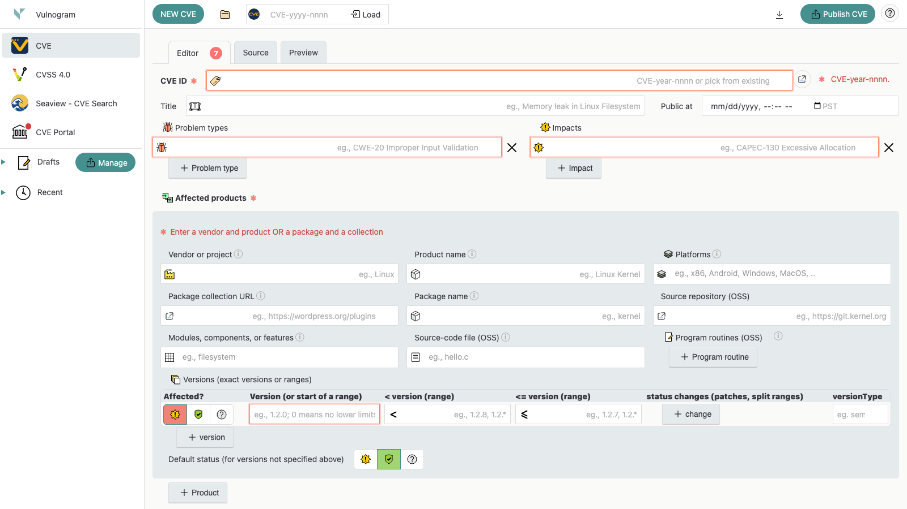
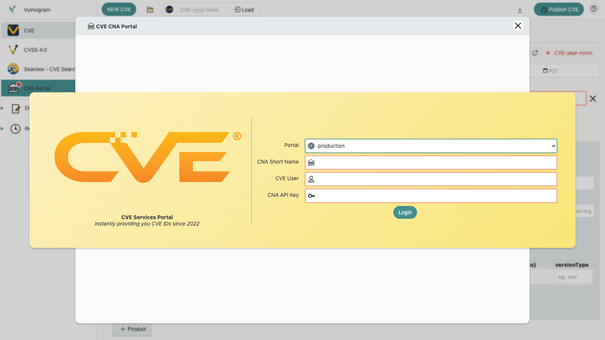
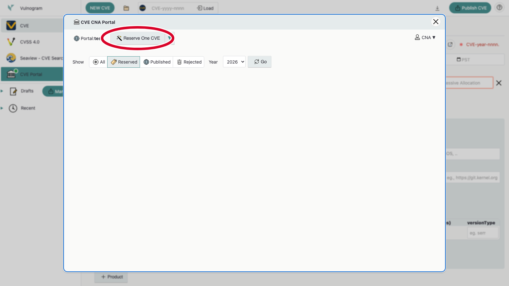
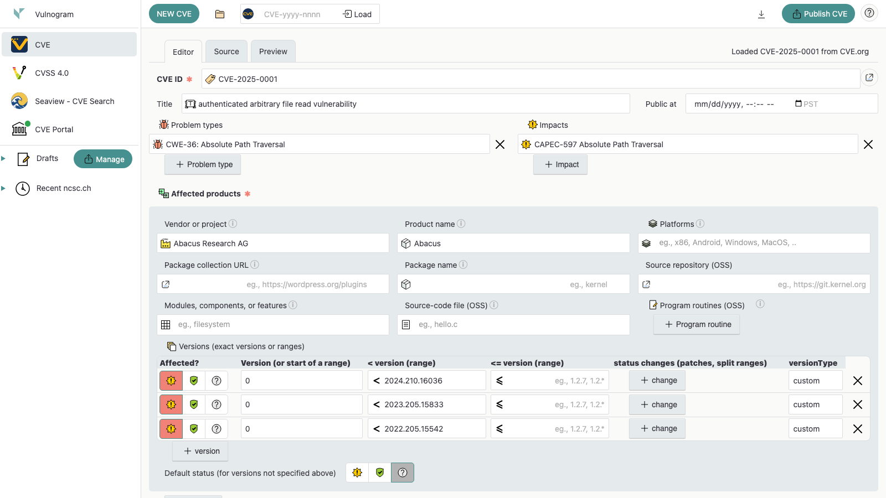
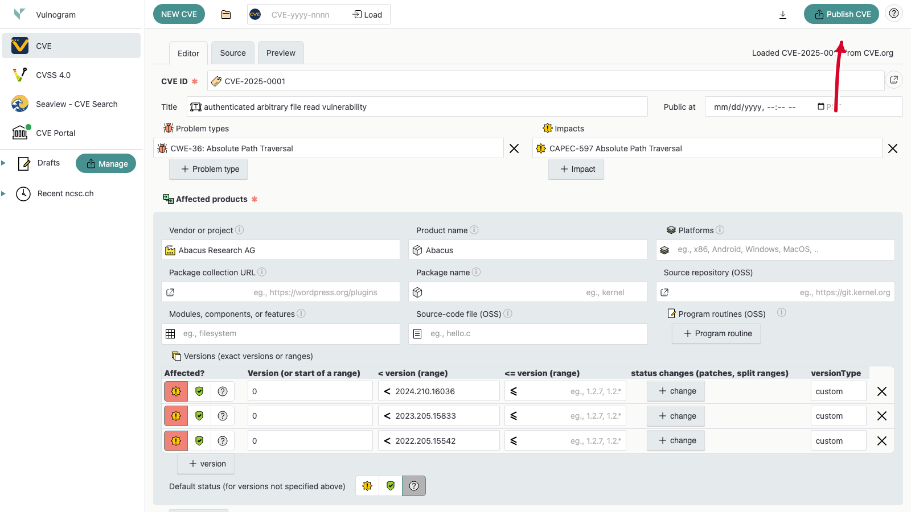
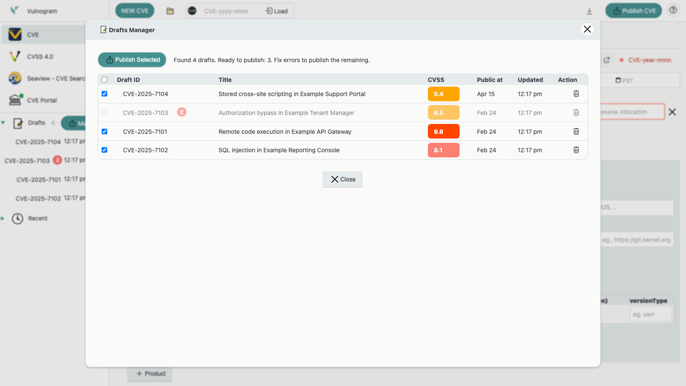

# Using Vulnogram with CVE Services

<link rel="stylesheet" href="https://vulnogram.org/1.0.0/css/min.css" />

This guide is adapted from [Using Vulnogram with CVE Services](undefined) and aligned to the current Vulnogram UI.

- Source PDF date: unknown
- Source PDF URL: undefined
- Last generated: 2026-02-25T06:49:29Z
- Screenshot refresh script: `node scripts/gendoc.js`

## 1. Access Vulnogram

Open Vulnogram and start in the CVE workspace. This screenshot shows the browser pointed at `https://www.vulnogram.org` with the URL visible.

*Access Vulnogram at https://www.vulnogram.org.*

## 2. Login to CVE Services

Open the **CVE Portal** panel, select the target portal (`production`, `test`, `adp-test`, or local), and authenticate with your CNA short name, CVE user, and API key.

*CVE Services login form from the portal sidebar action.*

## 3. Reserve CVE IDs

After login, use **Reserve One CVE** or the dropdown batch actions to reserve IDs for the current year, next year, or previous year. Use state/year filters to find reserved IDs.

*Portal reserve controls with state and year filters.*

## 4. Enter CVE Record Details

Use the editor tab to enter vulnerability details, affected products, references, and metrics. Switch between **Editor**, **Source**, and **Preview** tabs while drafting.

*Primary CVE editor form where record content is entered.*

## 5. Publish to CVE Services

Use **Publish CVE** to submit the record to the currently selected portal. In test mode, publishing targets the CVE Services test environment.

*Top action bar with publish control.*

*Drafts Manager with sample cached CVE entries ready for bulk publish.*

## 6. Manage Users and API Keys (Admin)

Organization administrators can open **Users** in the portal view to add users, update profile and role attributes, disable accounts, and reset API secrets.

*Admin-oriented user management view in the portal.*

## Regenerate Documentation

- Capture screenshots and regenerate markdown: `node scripts/gendoc.js`
- Regenerate markdown only: `node scripts/gendoc.js --no-capture`
- Capture specific screenshots: `node scripts/gendoc.js --only 02-portal-login,03-reserve-cve-ids`

The screenshot workflow is incremental: each image is hashed and only rewritten when the rendered output changes.
